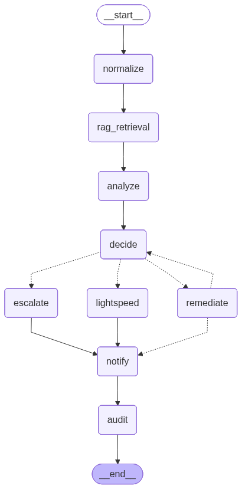

# Graph Nodes

The agent service processes incidents through a LangGraph state machine. Each node reads from and writes to `IncidentState`.

  

## Node Reference

### normalize

Parses `raw_event` into a structured `LogEvent` (namespace, pod, container, severity).

### rag_retrieval

Queries the knowledge base for runbook snippets relevant to the log event. Populates `context_snippets` and `rag_query_used`.

### analyze

Performs root cause analysis using an LLM. Produces a `RootCauseAnalysis` with `failure_type`, `confidence`, and `recommended_actions`.

### decide

Routes the incident based on confidence thresholds and failure type:

| Condition | Route |
|---|---|
| confidence >= `remediate_threshold` and known playbook type | `remediate` |
| confidence >= `remediate_threshold` and generation type | `lightspeed` |
| otherwise | `escalate` |

Thresholds are configurable via `GraphConfig`.

### remediate

Runs an AAP (Ansible Automation Platform) job to fix the incident.

**Flow:**

1. Takes the first `recommended_action` from the RCA as the AAP job template name.
2. Launches the job via LlamaStack tool invocation with context from the log event (namespace, pod, container, edge site).
3. Polls `get_job_status` until the job reaches a terminal status or the timeout expires (`GraphConfig.job_timeout`, default 120s).
4. On success — records the result and routes to `notify`.
5. On failure — records the attempt in `failed_attempts` and sets `should_retry = True` if under `GraphConfig.max_retries` (default 1). The graph loops back to `decide` for another attempt.
6. On timeout — records `timed_out = True` and routes directly to `notify` (no retry).

**Key files:**

- `remediate.py` — node factory and AAP job lifecycle
- `config.py` — shared HTTP client, terminal statuses, poll interval
- `utils.py` — LlamaStack tool invocation helper

### lightspeed

*Placeholder.* Will generate an Ansible playbook via Lightspeed for failure types without a known runbook.

### escalate

*Placeholder.* Will create a ServiceNow incident and notify the on-call team when confidence is too low for automated remediation.

### notify

*Placeholder.* Will send incident status notifications (Slack, email, ServiceNow updates).

### audit

*Placeholder.* Will persist the full incident record for compliance and post-incident review.
